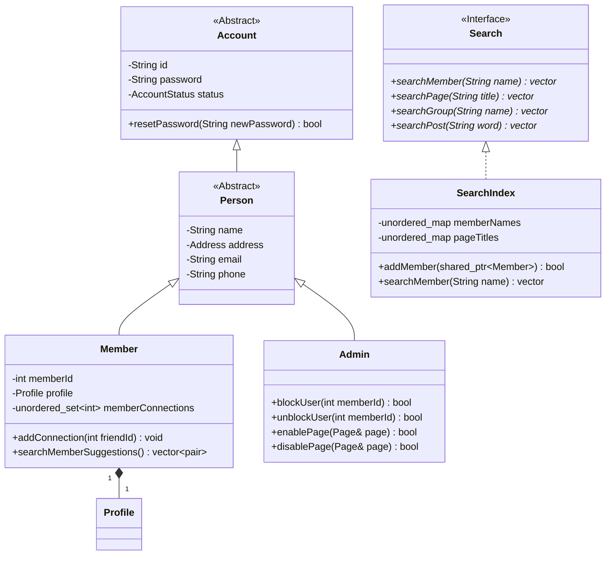
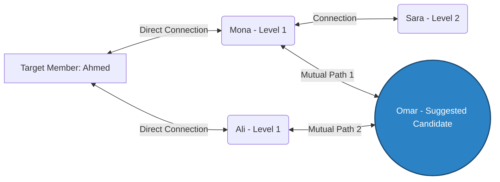
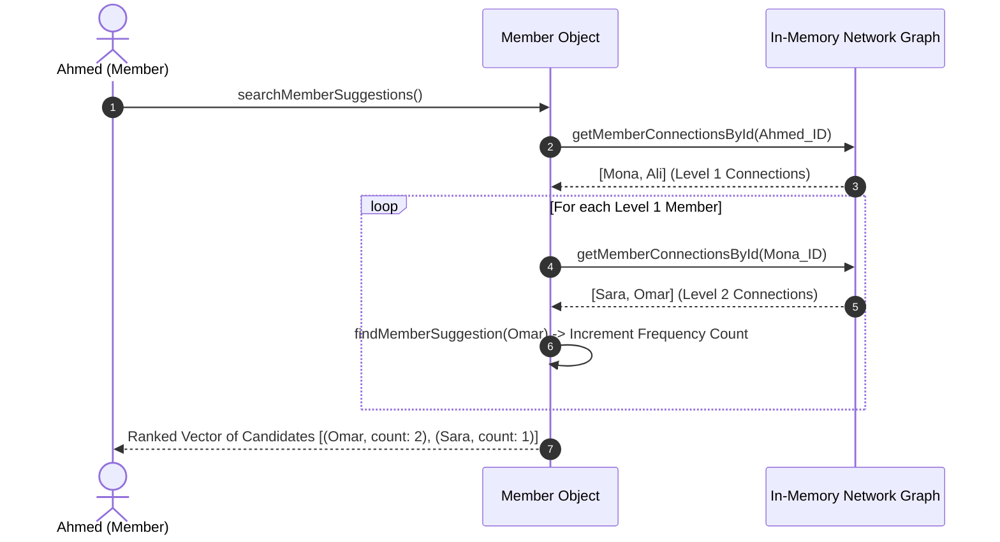
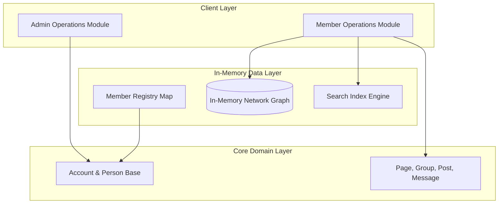

# Small Facebook 🚀

A high-performance, modular C++ object-oriented backend application that simulates core social media functionalities inspired by Facebook. The project models complex user relationships, social interactions, media publishing, search indexing, and administrative account controls using Clean Architecture principles and Modern C++ standards.

---

## 📝 Description

**Small Facebook** is a system design project aimed at modeling a social networking platform from scratch using pure C++. 

Instead of relying on heavy external database management systems, this project implements a low-latency, **In-Memory Graph Data Structure** to represent complex social networks.

The system is designed with strict adherence to **Object-Oriented Programming (OOP)**, **SOLID principles**, and memory safety using smart pointers (`std::shared_ptr`), providing an enterprise-grade architecture suitable for technical review and system design case studies.

---

## ✨ Key Features

- **Recommendation Engine:** Real-time graph algorithm prioritizing member suggestions based on mutual connection counts.
- **In-Memory Network Graph:** Ultra-fast $O(1)$ relationship lookups via `std::unordered_map` and `std::unordered_set`.
- **Role-Based Access Control:** Administrative oversight (`Admin`) capable of enforcing security actions (blocking/unblocking accounts, enabling/disabling pages).
- **Search Engine Indexing:** Decoupled search interface (`Search`) providing fast lookups for members, pages, groups, and posts.
- **Smart Memory Management:** Automatic resource tracking using Modern C++ RAII and smart pointer wrappers to eliminate memory leaks.

---

## 📐 System Architecture & Diagrams

### 1. Class Diagram (Domain Model)



### 2. "People You May Know" Graph Topology 

The recommendation algorithm traverses the target user's direct friends (Level 1) to evaluate their friends (Level 2). Mutual connection intersections are aggregated to rank recommendations.


###3. Connection Suggestion Execution Flow

4. High-Level Layered Architecture

📂 Directory Structure
```text
.
├── Account.hpp                     # Abstract base class for security/credentials
├── AccountStatus.hpp               # Account state enumeration
├── Address.hpp                     # Value object for locations
├── Admin.hpp                       # Administrative system operations
├── Comment.hpp                     # Post comments entity
├── ConnectionInvitation.hpp        # Connection invitation model & states
├── ConnectionInvitationStatus.hpp  # Status enum for connection requests
├── ForwardDeclarations.hpp         # System-wide type forward declarations
├── Group.hpp                       # Member communities entity
├── Member.hpp                      # Main user entity & recommendation logic
├── Message.hpp                     # Direct messaging entity
├── Page.hpp                        # Public social pages entity
├── Person.hpp                      # Personal details domain class
├── Post.hpp                        # Content publishing model
├── Profile.hpp                     # Member bio, work experience & history
├── Recommendation.hpp              # Page recommendation reviews
├── Search.hpp                      # Abstract search interface
├── SearchIndex.hpp                 # In-memory search index implementation
├── Work.hpp                        # Career profile entry
├── main.cpp                        # Main application entry point and demonstration
├── test.cpp                        # Test scenarios for core system functionality
└── README.md                       # Project documentation
```
🛠 Building & Running Small Facebook
Prerequisites

    A C++17 compatible compiler (g++ 7+, clang++ 5+, or MSVC 2017+)

Direct Terminal Compilation
```
    g++ -std=c++17 main.cpp -I. -o small_facebook
    ./small_facebook
